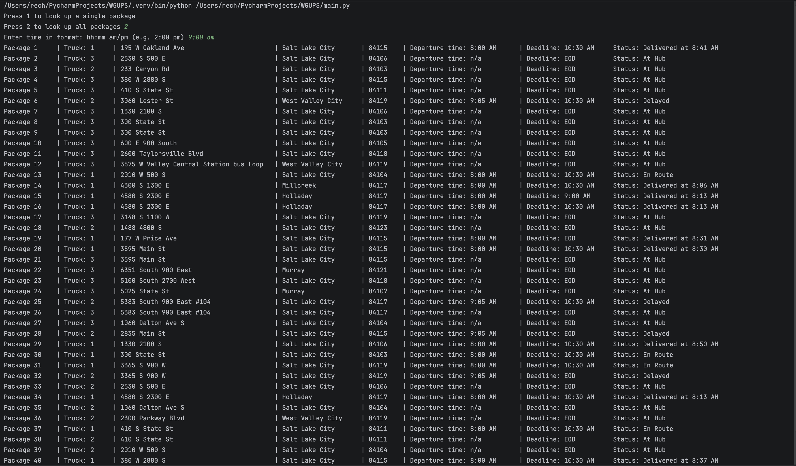
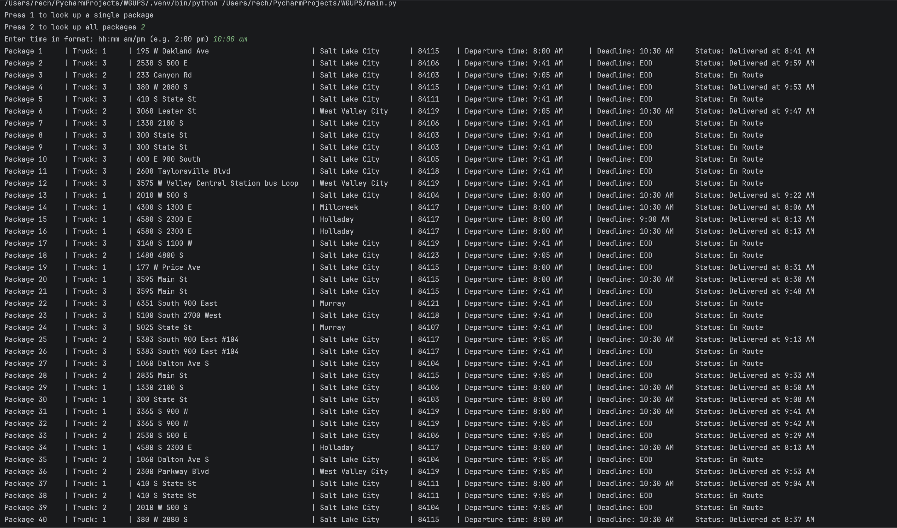
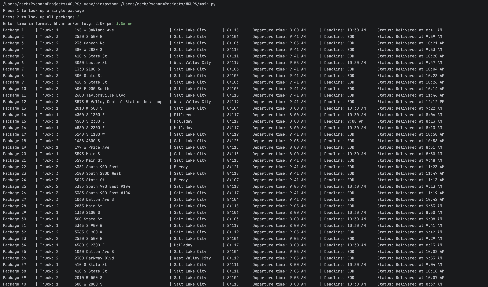
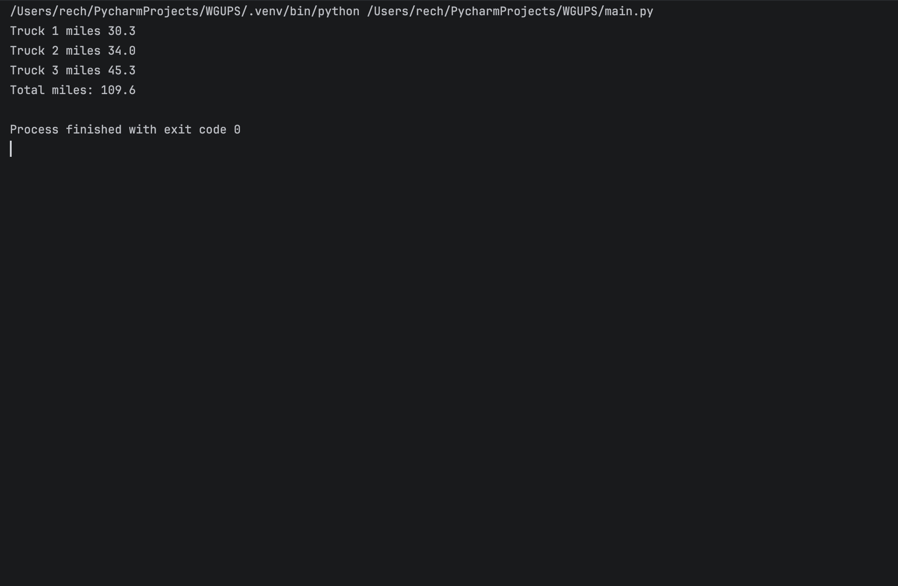

# Delivery Route Optimizer

A Python package delivery simulation that uses a custom hash table and a nearest-neighbor routing algorithm to efficiently deliver packages while accounting for delivery deadlines, delays, and other delivery constraints.

## Features

- Custom hash table for package storage and lookup
- Nearest-neighbor algorithm for delivery routing
- Three-truck delivery simulation
- Package deadline and delay handling
- Time-based package status tracking
- Address correction during an active delivery route
- Command-line interface for querying package status

## Results

The completed simulation delivered all 40 packages while satisfying the required delivery constraints.

- Truck 1: 30.3 miles
- Truck 2: 34.0 miles
- Truck 3: 45.3 miles
- **Total: 109.6 miles**

## Technologies

- Python
- Object-Oriented Programming
- Hash Tables
- Greedy / Nearest-Neighbor Algorithm
- CSV Data Processing
- Command-Line Interface

## Project Background

This project was originally developed as part of my Data Structures and Algorithms II coursework at Western Governors University. The goal was to design a package delivery system that could route deliveries efficiently while satisfying real-world constraints such as deadlines, delayed packages, limited driver availability, and address corrections.


## Running the Project

1. Make sure Python 3 is installed.
2. Clone or download this repository.
3. Navigate to the project directory.
4. Run:

```bash
python3 main.py
```

## Future Improvements

- Automate package-to-truck assignment instead of manually defining truck loads
- Explore alternative routing algorithms to further reduce total mileage
- Add automated tests for routing and package-status logic
- Improve the command-line interface and input validation

## Screenshots

### Package Status at 9:00 AM


### Package Status at 10:00 AM


### Package Status at 1:00 PM


### Truck Mileage


## License

Copyright © 2026 Richard Lee Echevarria. All rights reserved.

This source code is provided for portfolio and demonstration purposes only. No permission is granted to copy, modify, distribute, or use this code without prior written permission from the copyright holder.